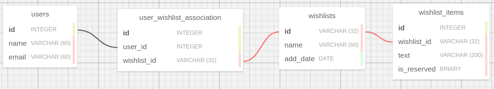
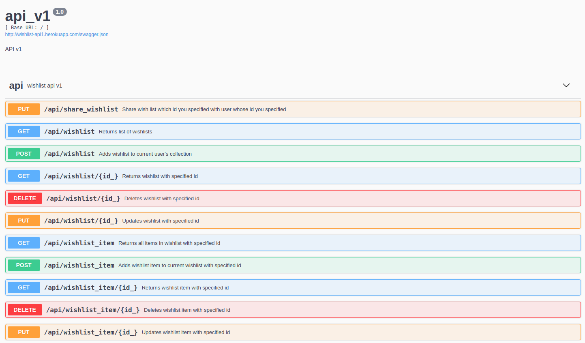

# WishlistApi

## Database schema


- Schema consists of 3 entity tables: users, wishlists and wishlist_items
- user_wishlist_association table is for many to many relation between users and wishlists

## Functional description
- User can log in via google account
- User can add wishlist 
- When logged in user fetches all wishlists he gets only wishlists which belong to him
- User can share any wishlist which belongs to current logged in user with other user
- User can add wishlist_items to specific wishlist
- User can set is_reserved flag in any wishlist_item which will prevent this item from deleting

## Project structure

- Service backend runs with flask and flask-restx framework 
  * app.wishlist package defines all logic related to api
  * app.auth package handles google authentication and creation of users
- Wsgi application runs via gunicorn in docker container
- Docker container deployed on heroku
- Postgres database runs separately in heroku

## Heroku link
### https://wishlist-api1.herokuapp.com/

### How to check api

- Firstly you need to log in via https://wishlist-api1.herokuapp.com/auth/login
- Then you can tinker with api via https://wishlist-api1.herokuapp.com/api/info

  Here you can use swagger ui to send requests
  

## To run project locally
 ```sh 
git clone https://github.com/rostislavborovyk/WishlistApi.git
```
 ```sh 
pip install poetry
```
 ```sh 
poetry install 
```
 ```sh 
bash prod.sh
```
P.S poetry will install all dependencies to your global python interpreter or you can create local venv

P.S.S: to run project locally you need some extra env variables, contact me if you want to run it 

## To run tests
Starts postgres db in docker container locally
```sh 
sudo docker-compose -f docker-compose-pg-db.yaml up -d
```
```sh 
pytest
```
Shuts down postgres db in docker container 
```sh 
sudo docker-compose -f docker-compose-pg-db.yaml down
```
